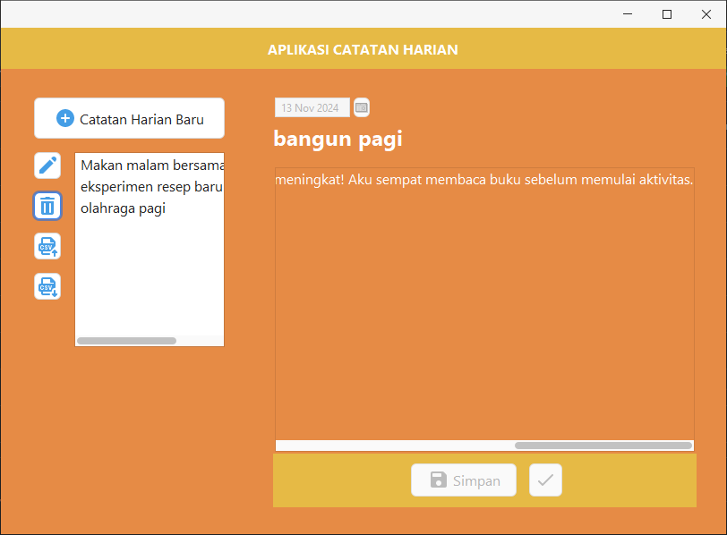
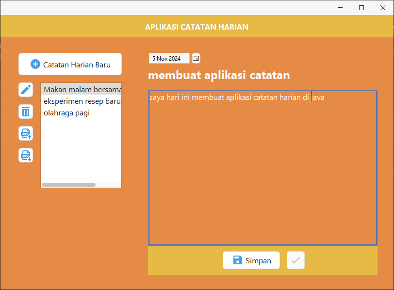
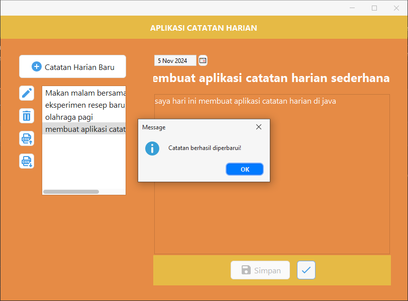
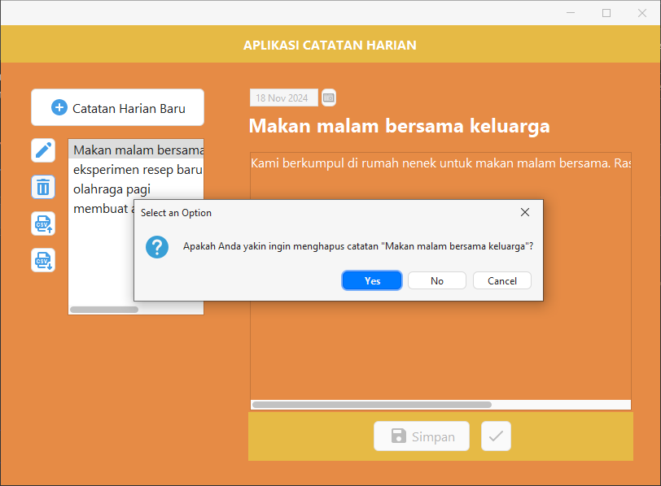
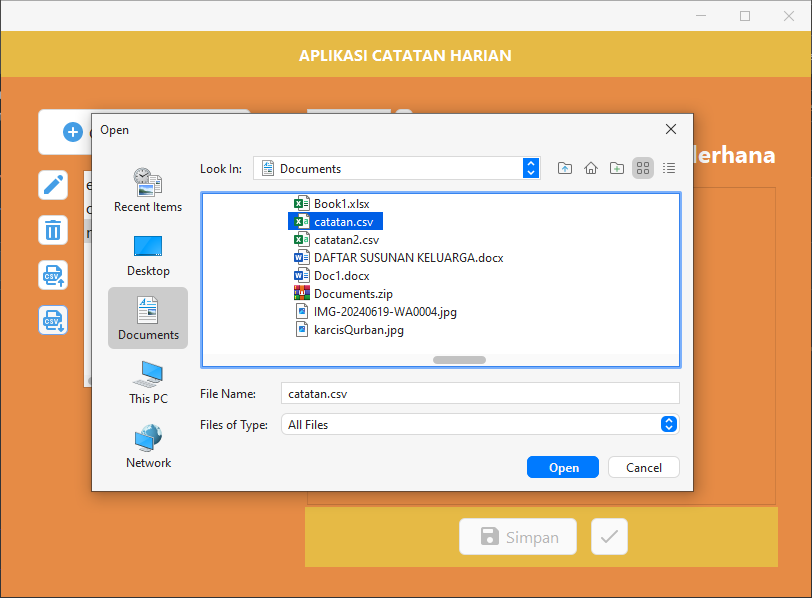
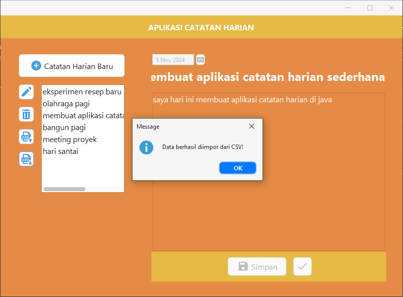
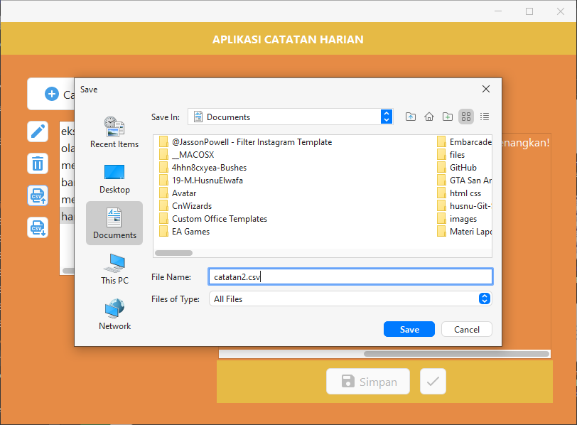
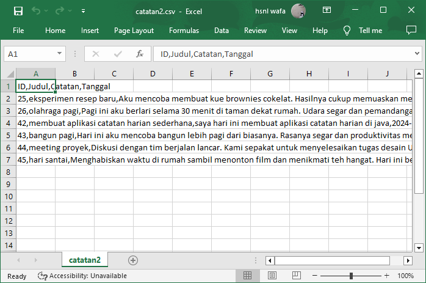

# **Catatan Harian**

Aplikasi **Catatan Harian** adalah aplikasi berbasis Java Swing yang memungkinkan pengguna untuk mencatat, menyimpan, dan mengelola catatan harian dengan antarmuka yang sederhana. Aplikasi ini menggunakan SQLite sebagai database untuk menyimpan data secara permanen dan mendukung ekspor/impor catatan dalam format CSV.

---

## **Fitur Utama**

1. **Membuat Catatan Baru:**
    
    - Pengguna dapat membuat catatan baru dengan memasukkan tanggal, judul, dan isi catatan.
    - Data catatan disimpan ke database SQLite.
2. **Melihat Daftar Catatan:**
    
    - Semua catatan yang tersimpan akan ditampilkan dalam daftar (`JList`), dengan nama item diambil dari judul catatan.
3. **Mengedit Catatan:**
    
    - Pengguna dapat memilih catatan dari daftar untuk melihat data lengkapnya (judul, tanggal, dan isi catatan).
    - Setelah menekan tombol **Edit**, pengguna dapat mengubah data tersebut, lalu menyimpan perubahan dengan tombol **Simpan Perubahan**.
4. **Menghapus Catatan:**
    
    - Pengguna dapat memilih catatan dari daftar dan menghapusnya.
5. **Ekspor Data ke CSV:**
    
    - Data catatan dapat diekspor ke file CSV untuk keperluan backup atau dibuka di aplikasi seperti Excel.
6. **Impor Data dari CSV:**
    
    - Pengguna dapat mengimpor file CSV untuk menambahkan catatan baru ke database.

---

## **Struktur Database**

Aplikasi menggunakan SQLite sebagai database. Tabel utama bernama `catatan` dengan struktur sebagai berikut:

|Kolom|Tipe Data|Keterangan|
|---|---|---|
|`id`|INTEGER|Primary key, auto increment|
|`judul`|TEXT|Judul catatan|
|`catatan`|TEXT|Isi catatan|
|`tanggal`|TEXT|Tanggal catatan (format `YYYY-MM-DD`)|

---

## **Cara Penggunaan**

1. **Menjalankan Aplikasi:**
    
    - Jalankan aplikasi melalui IDE seperti NetBeans atau file `.jar` yang telah di-build.
    - Pastikan library SQLite JDBC telah ditambahkan ke proyek.
2. **Membuat Catatan Baru:**
    
    - Klik tombol **Catatan Harian Baru**.
    - Pilih tanggal menggunakan **JDateChooser**.
    - Isi judul di **JTextField**.
    - Tulis isi catatan di **JTextArea**.
    - Klik tombol **Simpan** untuk menyimpan catatan.
3. **Melihat dan Memilih Catatan:**
    
    - Pilih catatan dari daftar yang tersedia di `JList`.
    - Data catatan (judul, tanggal, isi) akan ditampilkan di komponen input.
4. **Mengedit Catatan:**
    
    - Pilih catatan dari daftar.
    - Klik tombol **Edit** untuk mengaktifkan komponen input.
    - Lakukan perubahan data.
    - Klik tombol **Simpan Perubahan** untuk menyimpan perubahan ke database.
5. **Menghapus Catatan:**
    
    - Pilih catatan dari daftar.
    - Klik tombol **Hapus** untuk menghapus catatan.
6. **Ekspor ke CSV:**
    
    - Klik tombol **Ekspor**.
    - Pilih lokasi untuk menyimpan file CSV.
    - File akan berisi semua data catatan dalam format CSV.
7. **Impor dari CSV:**
    
    - Klik tombol **Impor**.
    - Pilih file CSV yang ingin diimpor.
    - Data dari file akan ditambahkan ke database dan daftar catatan diperbarui.

---

## **Format CSV**

File CSV yang digunakan untuk impor/ekspor memiliki format berikut:

### Ekspor csv
```java
private void eksporCSV(File file) {
    try (PrintWriter writer = new PrintWriter(file)) {
        writer.println("ID,Judul,Catatan,Tanggal");
        try (Statement stmt = conn.createStatement();
             ResultSet rs = stmt.executeQuery("SELECT * FROM catatan")) {
            while (rs.next()) {
                writer.println(rs.getInt("id") + "," +
                               rs.getString("judul") + "," +
                               rs.getString("catatan") + "," +
                               rs.getString("tanggal"));
            }
        }
        JOptionPane.showMessageDialog(this, "Data berhasil diekspor ke CSV!");
    } catch (IOException | SQLException e) {
        JOptionPane.showMessageDialog(this, "Gagal mengekspor CSV: " + e.getMessage());
    }
}
```

### Impor csv
```java
private void imporCSV(File file) {
    try (BufferedReader reader = new BufferedReader(new FileReader(file))) {
        String line = reader.readLine(); // Skip header
        while ((line = reader.readLine()) != null) {
            String[] data = line.split(",");
            simpanCatatan(data[1], data[2], data[3]);
        }
        JOptionPane.showMessageDialog(this, "Data berhasil diimpor dari CSV!");
        loadCatatan();
    } catch (IOException e) {
        JOptionPane.showMessageDialog(this, "Gagal mengimpor CSV: " + e.getMessage());
    }
}
```

`ID,Judul,Catatan,Tanggal 1,Belajar Java Swing,Hari ini belajar dasar-dasar Java Swing,2024-11-18 2,Meeting Tim,Diskusi proyek,2024-11-19`

- **ID**: Kolom unik (tidak perlu diisi saat impor).
- **Judul**: Judul catatan.
- **Catatan**: Isi catatan.
- **Tanggal**: Tanggal catatan dalam format `YYYY-MM-DD`.

---

## **Tampilan Aplikasi**

- ### tampilan awal aplikasi
  
  
- ### memasukkan tanggal, judul dan catatannya
  
  
- ### melakukan pengeditan data pada tanggal 
  
  
- ### menghapus catatan yang dipilih
  
    
- ### mengimpor file .csv eksternal ke dalam aplikasi
  
  
  
  
- ### mengeskpor catatan ke dalam bentuk file .csv
  
    
- ### hasil export
  

---

## **Persyaratan**

- **Java Development Kit (JDK):** Versi 8 atau lebih baru.
- **SQLite JDBC Library:** Tambahkan ke proyek Anda.
- **IDE:** NetBeans atau editor lain yang mendukung Java Swing.

---

## **Catatan Tambahan**

- Aplikasi ini dibuat untuk keperluan belajar dan penggunaan sederhana. Pastikan untuk mencadangkan data CSV Anda secara berkala.
- Jika terjadi masalah, pastikan database SQLite (`catatan.db`) berada di lokasi yang benar.

---

## **Kontribusi**

Jika Anda ingin mengembangkan aplikasi ini lebih lanjut, berikut beberapa ide pengembangan:

1. Menambahkan pencarian catatan berdasarkan judul atau tanggal.
2. Membuat antarmuka yang lebih modern dengan library Swing tambahan atau JavaFX.
3. Menambahkan fitur untuk mengelompokkan catatan berdasarkan kategori.
